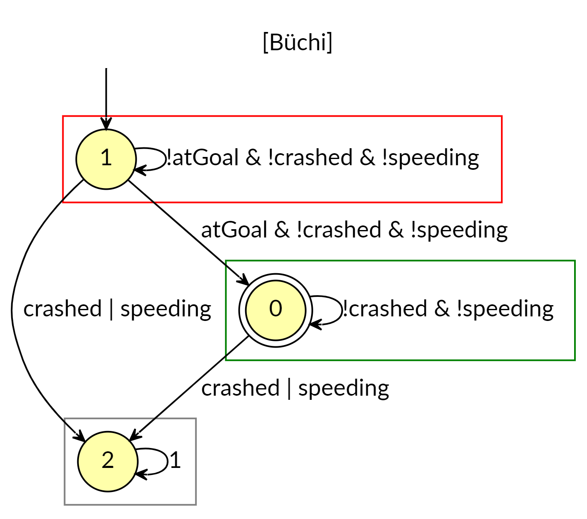
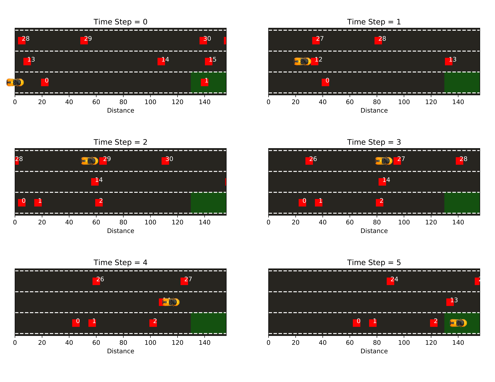

# autonomousCarControlSynthesis
*For optimal viewing of this document (and all `*.md` files), try opening it in a text editor that supports syntax highlighting for markdown `*.md` files (e.g. Sublime Text 2+).*

LTL to Control Synthesis (using formal methods concepts) Framework for a Basic Highway Driving Scenario.

[Nicholas Rennninger](https://github.com/nicholasRenninger) and [Richard Moon](https://github.com/RichardWasTaken)

---

## How to Run the Code


### Dependencies
This module was built in raw **python 2 ONLY**. the only external modules used were:

* `collections`: for their implementation of a queue
* `numpy`: for the matrix representation of the occupancy set
* `random`: for randomly generating traffic patterns through the occupancy set
* `matplotlib` *version 2+*: for plotting our final results. *You must have version>=2 or the plotting module will error out*

To get these dependencies, simply type:
* `pip install collections`
* `pip install numpy`
* `pip install random`
* `pip install matplotlib`

into a terminal that has the `*/PYTHON_2XX_INSTALL_DIR/Scripts/` and `*/PYTHON_2XX_INSTALL_DIR/` directories on its path, and you should be able to get these dependencies if you do not have them already.


### Running the Source Code

Navigate to the `autonomousCarControlSynthesis` directory and from a terminal with the current path being: `*/autonomousCarControlSynthesis/`, simply type `python main.py` to run our code. If you encounter errors running `python main.py` it is worth trying running like `pythonw main.py` as this has been found to be necessary on some anaconda installs of python2 on macOS.

### Configuring the Simulation

All configuration of the code is done in `initialize.py`. Changing these settings will change all relevant parameters in the simulation.

---

## Problem Setup

*Our problem is to guide the ego car through a multi-lane highway traffic scenario, where each lane has different acceptable speed ranges, such that the ego car exits the highway as quickly as possible while guaranteeing that the ego car does not crash into any other vehicles.*

The problem is solved using a *formal methods* inspired control synthesis framework, where the specification the ego car must follow is given as an automaton and the environment (highway and other cars) is given as another finite transition system automaton. We then take the product of the two automaton and then solve the deterministic game with a time-optimizing graph reachability algorithm to find a path the through the product automaton that is both **accepting** and **time-optimal**.

The specification that the synthesizes ego car controller is guaranteed is expressed as a Buchi Automaton and is shown below. 



The product transition system representing the car and environment gives observations of the predicates (*atGoal*, *crashed*, *speeding*) that the final reachability / time optimization analysis used to pick an optimal controller that follows the specification Buchi automaton.

More info can be found in the included paper, *"Speed Controller for an Autonomous Car"*.

---

## Results

Below is a sample of the result of the simulation, showing the optimal trajectory of the ego car (Orange McLaren) through the randomly generated other highway vehicles (red boxes) to the desired highway exit (green region).



Results are displayed using `matplotlib` and exported as a `.pdf` to `Figures/results.pdf`

More info can be found in the included paper, *"Speed Controller for an Autonomous Car"*.

---

## DO NOT USE PYTHON 3

Unfortunately, if you use python3, we ran into a nasty python / system level error that was unresolvable after much research:

```powershell
Traceback (most recent call last):
File ".\main.py", line 71, in <module>
    main()                                                                     
    File ".\main.py", line 63, in main
        acceptingGoalNode = DFA.formAndSolveProduct(TS=TS, LDBA=LDBAObj)       

SystemError: error return without exception set
```

We believe our algorithms were correct, but their inherent exponential blowup may have strained system level libraries and caused unexpected, unhandled faults that give little information to debug with.
